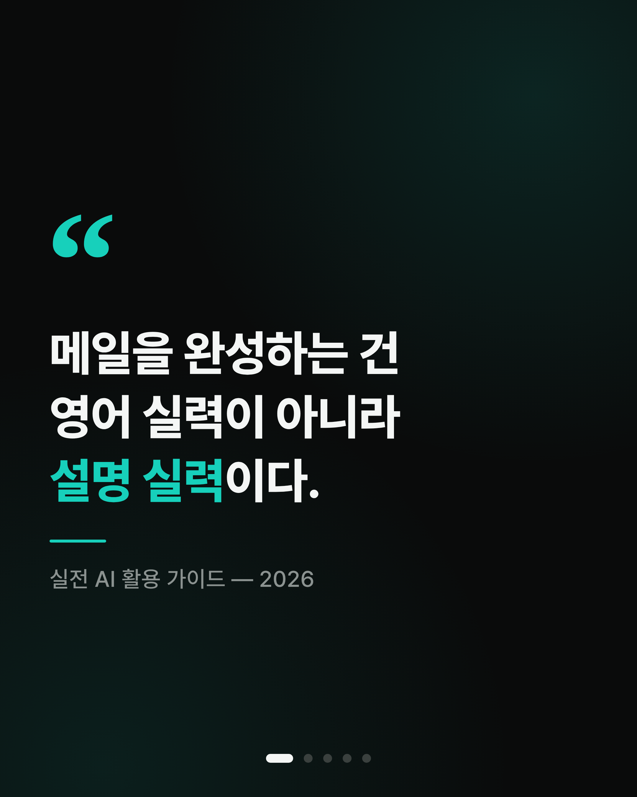

# SNS 캐러셀 카드 생성기

다크 배경 + 청록(teal) 포인트의 **세로형 1080×1350 (4:5)** 인스타그램 캐러셀 카드를
HTML/CSS 로 만들고, 사전 설치된 Chromium 으로 **고해상도 PNG** 를 자동 추출합니다.

빌드 도구·프레임워크 없이 순수 HTML/CSS/JS 이며, Pretendard 폰트를 저장소에 포함해
**오프라인**에서도 화면·PNG 모두 동일하게 나옵니다.



현재 **"실전 AI 활용 가이드" 시리즈 5종**(각 5장, 총 25장)이 예시로 들어 있습니다.

| slug | 주제 |
|------|------|
| `1-email`   | 영어 이메일 |
| `2-meeting` | 회의록 정리 |
| `3-report`  | 보고서 초안 |
| `4-excel`   | 엑셀 · 데이터 |
| `5-resume`  | 자기소개서 |

## 폴더 구조

| 파일 | 역할 |
|------|------|
| `slides.js`   | **여기만 고치면 됩니다.** 캐러셀 내용 + 템플릿 (`CAROUSELS` 배열) |
| `styles.css`  | 디자인 시스템(색·폰트·레이아웃) |
| `index.html`  | 브라우저 미리보기 (상단 버튼으로 캐러셀 선택, ← → 로 슬라이드 이동) |
| `render.html` | PNG 추출용 렌더 페이지 (직접 열 필요 없음) |
| `export.mjs`  | 각 슬라이드를 `out/<slug>/slide-NN.png` 로 저장 |
| `server.mjs`  | 로컬 미리보기 서버 |
| `fonts/`      | Pretendard woff2 (오프라인용) |
| `out/`        | 추출된 PNG 결과물 (캐러셀별 폴더) |

## 사용법

```bash
npm install          # 최초 1회 (Playwright 설치)

npm run serve        # http://localhost:8080 에서 미리보기
npm run export       # 모든 캐러셀을 out/<slug>/ 에 PNG 저장 (기본 2160×2700, 고해상도)
```

- 정확히 1080×1350 로 뽑으려면: `SCALE=1 npm run export`
- 특정 캐러셀만: `SLUG=2-meeting npm run export`
- 이 저장소 환경에서는 사전 설치된 Chromium 을 사용합니다. 다른 경로면:
  `CHROMIUM_PATH=/path/to/chrome npm run export`

## 새 캐러셀 만들기

`slides.js` 의 `CAROUSELS` 배열에 `{ slug, title, slides: [...] }` 를 추가하세요.
`slug` 는 PNG 저장 폴더 이름, `slides` 는 슬라이드 배열이며 각 항목의 `type` 으로 레이아웃을 고릅니다.

| type | 레이아웃 | 주요 필드 |
|------|----------|-----------|
| `quote`    | 표지 인용구 | `headline`, `caption` |
| `hook`     | 이메일 목업 + 헤드라인 | `mail{to,line1,line2,line3,sticker}`, `headline` |
| `section`  | before → after 카드 | `badge`, `title`, `before{label,body}`, `after{label,body}`, `footer` |
| `timeline` | 아이콘 타임라인 | `badge`, `title`, `items[{icon,title,desc}]`, `pill` |
| `chat`     | 채팅(프롬프트) 목업 | `badge`, `title`, `window`, `prompt`, `respTitle`, `footer` |

### 텍스트 팁
- **줄바꿈**: 문자열 안에 `\n`
- **청록 강조**: `<span class="tl">강조할 부분</span>`
- **더 크게**: `hook` 헤드라인에서 `<span class="tl big">`
- 타임라인 아이콘: `people` · `target` · `pencil` (추가하려면 `slides.js` 의 `ICONS` 참고)

### 색/폰트 바꾸기
`styles.css` 상단 `:root` 의 CSS 변수만 수정하면 전체에 반영됩니다.
포인트 컬러는 `--accent`, 배경은 `--bg` 입니다.

## 규격
- 캔버스: **1080 × 1350 px (4:5)** — 인스타그램 세로 캐러셀 권장 규격
- 폰트: Pretendard (OFL, 저장소 포함)
